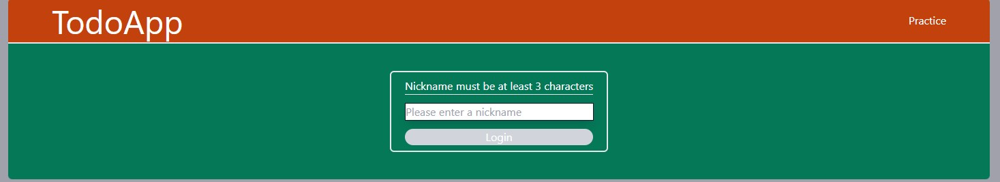
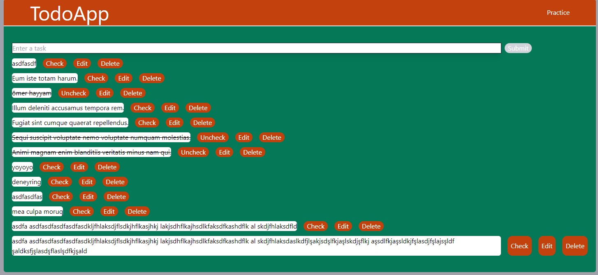
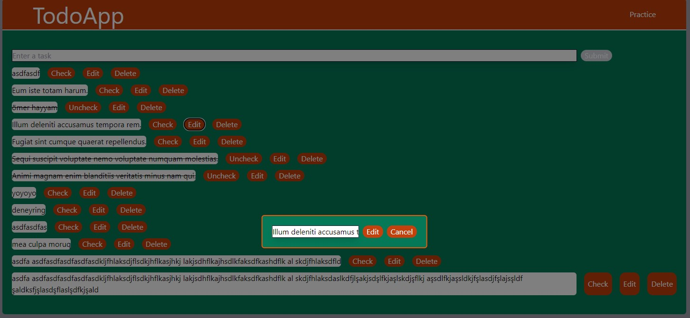

# Simple Todo App project

I created a CRUD todo app that a user can create, read, update and delete data.

This web app built with using [Vite](https://vitejs.dev/) + [React](https://reactjs.org/).

Used [mockAPI](https://mockapi.io/) API to get and create the data I needed.

You can access demo [here](https://quite-orange-todo-app.netlify.app).

### Project Details

- [React](https://reactjs.org/)
- [Vite](https://vitejs.dev/)
- [Tailwind CSS](https://tailwindcss.com/)
- [Axios](https://axios-http.com/docs/intro) for making API calls
- [React-Query-v3](https://react-query-v3.tanstack.com/) for making API calls better

### Images

---

#### Auth



#### Todos



#### Edit



---

### Install dependencies

```
npm install
```

### Run Vite dev server

```
npm run dev
```

### To build for production

```
npm run build
```
